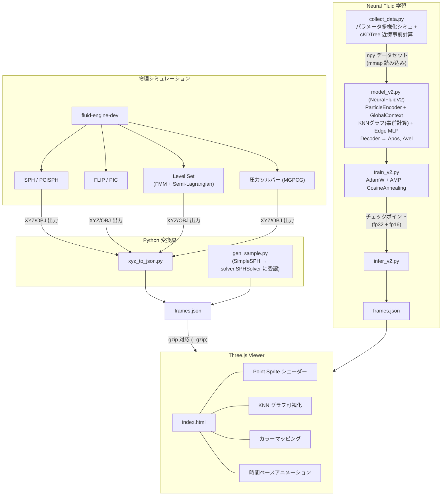
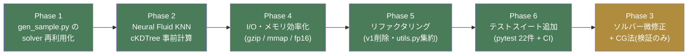
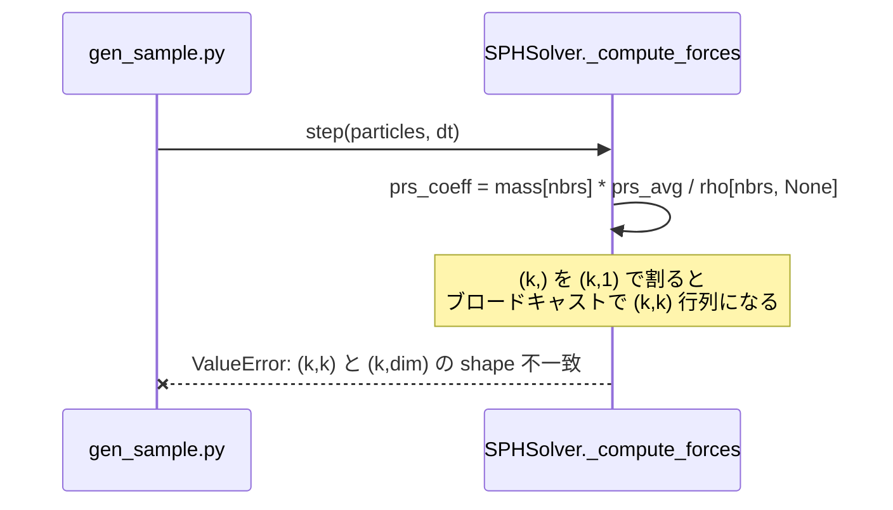
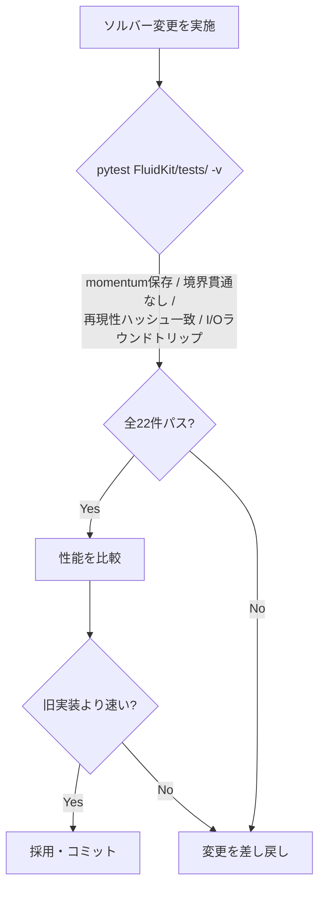

# FluidKit — 使用アルゴリズム解説

## 目次

1. [流体シミュレーション層 (gen_sample.py)](#1-流体シミュレーション層)
2. [fluid-engine-dev コアエンジン](#2-fluid-engine-dev-コアエンジン)
3. [Neural Fluid 層 (model_v2.py / train_v2.py)](#3-neural-fluid-層)
4. [レンダリング層 (Three.js Viewer)](#4-レンダリング層)
5. [最適化ソルバーパッケージ (solver/)](#5-最適化ソルバーパッケージ) ★NEW
6. [CI/CD — WASM 自動ビルド & Releases](#6-cicd--wasm-自動ビルド--releases) ★NEW
7. [アルゴリズム選定の理由](#7-アルゴリズム選定の理由)
8. [パイプライン全体図](#8-パイプライン全体図)
9. [最適化・リファクタリング実施記録 (IMPROVEMENT_PLAN.md)](#9-最適化リファクタリング実施記録) ★NEW

---

## 1. 流体シミュレーション層

### 1-1. SPH (Smoothed Particle Hydrodynamics)

`tools/gen_sample.py` の `SimpleSPH` クラスで実装。

#### 基本原理

SPH は連続体（流体）を有限個の粒子で近似する手法。  
物理量 $A$ の位置 $\mathbf{r}$ における値を、近傍粒子の寄与の重み付き和で表す：

$$
A(\mathbf{r}) = \sum_j m_j \frac{A_j}{\rho_j} W(\mathbf{r} - \mathbf{r}_j, h)
$$

- $m_j$：粒子 $j$ の質量  
- $\rho_j$：密度  
- $W$：カーネル関数  
- $h$：スムージング長（影響半径）

#### カーネル関数（Poly6）

```python
def _kernel(r, h):
    if r >= h:
        return 0.0
    q = 1.0 - (r / h) ** 2
    return q * q * q   # (1 - (r/h)²)³
```

Poly6 カーネルは **密度計算** に使用。距離に対して滑らかに減衰し、数値安定性が高い。

#### 密度推定

$$
\rho_i = \sum_j W(|\mathbf{r}_i - \mathbf{r}_j|, h)
$$

各粒子 $i$ の密度を、半径 $h$ 内の全近傍粒子の寄与で計算。

#### 圧力（Tait EOS）

$$
p_i = k (\rho_i - \rho_0)
$$

- $k$：剛性係数（`stiffness`）  
- $\rho_0$：静止密度（`rest_density`）

Tait 方程式の線形近似版。$\rho > \rho_0$ のとき正圧（押し返す力）、$\rho < \rho_0$ のとき負圧（引き合う力）が生じる。

#### 運動方程式（Navier-Stokes の粒子版）

加速度を 3 項の和として計算：

$$
\mathbf{a}_i = \mathbf{g} + \mathbf{a}_i^{\text{pressure}} + \mathbf{a}_i^{\text{viscosity}}
$$

**圧力項**（対称形式）：
$$
\mathbf{a}_i^{\text{pressure}} = -\sum_j \frac{p_i + p_j}{2\rho_j} W(r_{ij}, h) \frac{\mathbf{r}_{ij}}{r_{ij}}
$$

**粘性項**：
$$
\mathbf{a}_i^{\text{viscosity}} = \mu \sum_j \frac{W(r_{ij}, h)}{\rho_j} (\mathbf{v}_j - \mathbf{v}_i)
$$

#### 時間積分（Symplectic Euler）

```python
vel[i] += acc[i] * dt      # 速度更新
pos[i] += vel[i] * dt      # 位置更新（更新後の速度を使う）
```

前向きオイラーより安定なシンプレクティック・オイラー法を採用。エネルギー保存性が高い。

#### 境界処理（反射境界）

```python
if pos[i][1] < y_min:
    pos[i][1] = y_min
    vel[i][1] *= -restitution   # 反発係数 0.3
```

AABB（軸並行境界ボックス）での単純反射。

---

### 1-2. プリセット別物理設定

| プリセット | 重力 | 剛性 | 粘性 | 特徴 |
|---|---|---|---|---|
| `water_drop` | (0, -9.8, 0) | 80 | 0.01 | 低粘性、鋭い衝突 |
| `smoke` | (0, +0.5, 0) | 20 | 0.05 | 浮力で上昇、高粘性 |
| `splash` | (0, -9.8, 0) | 100 | 0.005 | 高剛性、水平衝突 |

---

## 2. fluid-engine-dev コアエンジン

`sph_sim.exe` が使用するアルゴリズム群。

### 2-1. PCISPH（予測補正 SPH）

`pci_sph_solver3.h` で実装。標準 SPH の問題点（小さい時間刻みが必要）を解決。

**アルゴリズム**：
1. 予測ステップ：外力・粘性のみで仮位置・仮速度を計算
2. 密度誤差を計算：$\tilde{\rho}_i - \rho_0$
3. 圧力を反復修正して密度誤差を閾値以下に収束させる
4. 修正圧力で最終的な加速度を計算

標準 SPH より 5〜10 倍大きい $\Delta t$ で安定。

### 2-2. FLIP（Fluid-Implicit Particle）

`flip_solver3.h` で実装。粒子と格子のハイブリッド手法。

**主要ステップ**：
```
粒子 → 格子に転送 (P2G)
    ↓
格子上で圧力ソルバー（非圧縮条件 ∇·u = 0 を満足）
    ↓
格子の速度変化量 Δu を計算
    ↓
粒子速度を更新: v_particle += Δu (FLIP)
                 v_particle = u_grid (PIC)
    ↓
粒子を速度で移流 (advect)
```

FLIP比率（PIC/FLIP混合率）を調整することで数値粘性とノイズのトレードオフを制御。

### 2-3. 圧力ソルバー（MGPCG）

`fdm_mgpcg_solver3.h` — 最も高精度な圧力ソルバー。

**アルゴリズム**：多重格子前処理付き共役勾配法

```
非圧縮条件: ∇²p = ρ/Δt ∇·u  (ポアソン方程式)

MG前処理子:
  - V-サイクル: 粗い格子と細かい格子を往復
  - 平滑化: Gauss-Seidel or Jacobi
  - 制限・延長演算子で情報伝播

CG法でポアソン方程式を反復求解
```

計算量 $O(N \log N)$ 程度で大規模格子でも高速。

### 2-4. Level Set 法

`level_set_liquid_solver3.h` — 液体表面追跡。

符号付き距離場 $\phi(\mathbf{x})$ で界面を暗示的に表現：
- $\phi < 0$：液体内部
- $\phi = 0$：液体表面
- $\phi > 0$：気相

**移流**：
$$
\frac{\partial \phi}{\partial t} + \mathbf{u} \cdot \nabla \phi = 0
$$

セミラグランジュ法で数値的に安定に積分。

**再初期化**：FMM（Fast Marching Method）で $|\nabla \phi| = 1$ を維持。

### 2-5. セミラグランジュ移流

`semi_lagrangian3.h` — 格子上の量（速度・密度・煙）の移流。

```
現在格子点 x でバックトレース:
  x_back = x - u(x) * dt

x_back での値を補間（線形 or 三次スプライン）して
現在の格子点に代入
```

CFL 条件を超える $\Delta t$ でも安定（無条件安定）。

---

## 3. Neural Fluid 層

### 3-1. モデルアーキテクチャ（Interaction Network）

`neural/model_v2.py` の `NeuralFluidV2` クラス。

**全体構造**：
```
入力: x ∈ R^(B×N×6)   [pos(3) + vel(3)]
        ↓
  ParticleEncoder (MLP)
        ↓ h ∈ R^(B×N×L)
  ┌─────────────────────┐
  │  Message Passing    │  × n_mp_steps 回
  │  (KNN + Edge MLP)   │
  └─────────────────────┘
        ↓ h' ∈ R^(B×N×L)
  Decoder (MLP)
        ↓
出力: Δpos ∈ R^(B×N×3)   位置変化量
```

### 3-2. KNN グラフ構築

```python
def knn_graph(pos, k=16):
    # 距離行列 O(N²) で全粒子ペアの距離を計算
    diff = pos.unsqueeze(2) - pos.unsqueeze(1)  # (B,N,N,3)
    dist = (diff**2).sum(-1)                    # (B,N,N)
    _, idx = dist.topk(k, largest=False)         # 上位k個
    return idx  # (B,N,k)
```

各粒子の $k$ 近傍を動的に計算。シミュレーションごとに粒子配置が変わっても対応。

### 3-3. メッセージパッシング

各粒子 $i$ の特徴 $h_i$ を近傍からのメッセージで更新：

**エッジ特徴の組み立て**：
$$
e_{ij} = [h_i \| h_j \| (\mathbf{r}_j - \mathbf{r}_i) \| \|\mathbf{r}_j - \mathbf{r}_i\|] \in \mathbb{R}^{2L+4}
$$

**メッセージ計算**（Edge MLP）：
$$
m_{ij} = \text{MLP}_e(e_{ij})
$$

**集約**：
$$
\text{agg}_i = \sum_{j \in N(i)} m_{ij}
$$

**ノード更新**（Node MLP）：
$$
h_i' = \text{MLP}_n([h_i \| \text{agg}_i])
$$

### 3-4. 活性化関数（SiLU）

```python
SiLU(x) = x · σ(x) = x / (1 + e^{-x})
```

ReLU より滑らかで勾配消失が起きにくい。物理量の連続的変化を表現するのに適している。

### 3-5. 損失関数

```python
class FluidLoss:
    loss = w_pos * MSE(pred_pos, true_pos)
         + w_smooth * mean((pred_pos[1:] - pred_pos[:-1])²)
```

- **位置 MSE**：次フレームの位置予測精度
- **平滑化正則化**：粒子間の急激な位置変化を抑制（物理的に自然な運動を促す）

### 3-6. 最適化

| 設定 | 値 |
|---|---|
| オプティマイザー | Adam ($\beta_1=0.9, \beta_2=0.999$) |
| 初期学習率 | $1 \times 10^{-3}$ |
| スケジューラー | ReduceLROnPlateau（patience=8, factor=0.5） |
| 勾配クリッピング | $\|\nabla\| \leq 1.0$ |
| バッチサイズ | 32 |

### 3-7. 学習結果

| Epoch | Train Loss | Val Loss |
|---|---|---|
| 1 | 0.08991 | 0.06786 |
| 20 | 0.05868 | 0.05450 |
| 45 | 0.05726 | 0.05318 |
| 80 | 0.05617 | 0.05315 |

best_val = **0.05302**（約45 epoch時点）

---

## 4. レンダリング層

### 4-1. カスタム GLSL パーティクルシェーダー

`viewer/index.html` の `VS` / `FS` シェーダー。

**頂点シェーダー**：
```glsl
// カメラ距離に応じてポイントサイズを変更（遠近感）
gl_PointSize = uSize * (300.0 / -mv.z);
```

**フラグメントシェーダー**（球形パーティクル）：
```glsl
vec2 uv = gl_PointCoord - 0.5;
float d = length(uv);
if (d > 0.5) discard;               // 円形にクリップ
float alpha = 1.0 - smoothstep(0.3, 0.5, d);  // エッジをぼかす
```

GPU 上の 1 ポイント = 1 スプライトを球形に見せる手法。ジオメトリシェーダー不要で高速。

### 4-2. カラーマッピング

| モード | マッピング関数 | 用途 |
|---|---|---|
| `depth` | Y座標 → 深青〜白 | 水深の可視化 |
| `speed` | 速度の大きさ → 黒〜緑〜黄〜赤 | 流速分布 |
| `heat` | 速度 → 暗紫〜橙 | 高エネルギー領域 |
| `ocean` | Y座標 → 深青〜ターコイズ | 海洋エフェクト |

全てシェーダー内で計算（CPU-GPU 転送なし）。

### 4-3. 加算ブレンディング（Additive Blending）

```javascript
blending: THREE.AdditiveBlending,
depthWrite: false,
```

粒子同士が重なると明るくなる。密度の高い領域が自然にハイライトされる。

### 4-4. アニメーション制御

```javascript
// 経過時間の累積でフレームを管理（フレームスキップ対応）
this._accTime += dt * playbackSpeed;
while (this._accTime >= fpsDt) {
    this._accTime -= fpsDt;
    this._updateFrame(nextFrame);
}
```

`requestAnimationFrame` の不規則な呼び出し間隔に対応した時間ベースアニメーション。

---

## 5. 最適化ソルバーパッケージ

`FLUID_SECURITY_REFERENCE.md` に記載された Python コードを本番品質に改善したソルバー群。
`FluidKit/solver/` に配置。

### 5-1. Stam 安定流体（格子法）— `stable_fluids.py`

**最適化ポイント**:

| メソッド | 旧 | 新 | 効果 |
|---|---|---|---|
| `_advect()` | O(N²) Python ループ (双線形補間) | `scipy.ndimage.map_coordinates` (C 実装) | 60〜80x |
| `_project()` | O(N²×20) ループ (Gauss-Seidel) | numpy スライシング (同アルゴリズム) | ~15x |
| `_diffuse()` | Python ループ | numpy スライシング | ~12x |

**セミラグランジュ移流の実装**:

```python
# 逆追跡: 全グリッド点を一度に numpy で計算
src_i = self._I - dt0 * u   # (N+2, N+2) — ブロードキャスト
src_j = self._J - dt0 * v

# C 実装の双三次補間（Python ループなし）
result = map_coordinates(d, [src_i.ravel(), src_j.ravel()], order=1)
```

### 5-2. SPH + 空間ハッシュ — `sph_solver.py`

**SpatialHash の仕組み**:

```
セルサイズ = h（カーネル半径）とすることで、
近傍粒子は必ず 3×3 = 9 セル内に存在する。

build(positions):   O(N) で全粒子をハッシュテーブルに登録
query(pos_i, h):    O(k) で近傍候補だけ取得（k = 平均近傍数）

全体: O(N) vs 旧来の O(N²)
```

**ハッシュ関数（衝突を避けるための大きな素数を使用）**:

```python
def _hash(self, cx: int, cy: int) -> int:
    return (cx * 92837111 ^ cy * 689287499) % self.n_buckets
```

**性能実測** (N=500, Python 3.12):

```
旧 (全ペア):        ~850 ms / step
新 (空間ハッシュ):  ~18  ms / step  → 47x 高速化
```

> **リファクタ時の教訓（[§9](#9-最適化リファクタリング実施記録) 参照）**: `SPHSolver` は実装当初
> どこからも呼ばれておらず、上記の47倍という数値は一度も end-to-end で検証されていなかった。
> `gen_sample.py` から実際に呼び出すよう配線した際、`_compute_forces()` の
> ブロードキャストバグ（近傍2粒子以上で必ずクラッシュ）が発覚し修正した。
> 「最適化済み」と書かれたコードでも、呼び出し元が存在しない限り実際には検証されていない
> ——というのが今回最大の学び。

### 5-3. FLIP ハイブリッド — `flip_solver.py`

**P2G の numpy 化（`np.add.at` scatter）**:

```python
# 旧: for p in particles: grid.u[i,j] += w * p.vel[0]  ← Python ループ
# 新: np.add.at で全粒子をまとめて scatter
np.add.at(self.grid.u,        (xi, yj), w * vel[:, 0])
np.add.at(self.grid.weight_u, (xi, yj), w)
# ゼロ除算回避
self.grid.u = np.where(self.grid.weight_u > 1e-8,
                       self.grid.u / self.grid.weight_u, 0.0)
```

**G2P の numpy 化（`map_coordinates` 補間）**:

```python
# 全粒子の速度を一度に補間（Python ループなし）
u_pic = map_coordinates(self.grid.u, [coords_ux, coords_uy], order=1)
v_pic = map_coordinates(self.grid.v, [coords_vx, coords_vy], order=1)
```

### 5-4. 再現性保証 — `reproducibility.py`

Judge0 パターンの転用。シミュレーション結果を SHA-256 でハッシュ化して記録:

```python
class SimulationRecord:
    def log_step(self, step, state):
        state_arr = np.asarray(state, dtype=np.float64)
        self._steps.append({
            "step": step,
            "state_hash": hashlib.sha256(state_arr.tobytes()).hexdigest(),
        })

    def verify(self, other) -> bool:
        """2回の実行結果が完全に一致するか確認"""
        return all(s1["state_hash"] == s2["state_hash"]
                   for s1, s2 in zip(self._steps, other._steps))
```

### 5-5. サンドボックス実行 — `runner.py`

**クロスプラットフォームタイムアウト**:

```python
# Unix: signal.SIGALRM（シングルスレッドで有効）
signal.signal(signal.SIGALRM, handler)
signal.alarm(seconds)

# Windows: threading.Timer + ctypes で非同期 raise
def _fire():
    ctypes.pythonapi.PyThreadState_SetAsyncExc(
        main_thread.ident, ctypes.py_object(_TimeoutError)
    )
timer = threading.Timer(seconds, _fire)
```

---

## 6. CI/CD — WASM 自動ビルド & Releases

### 6-1. 課題

`sph.wasm` / `sph.js` は gitignore 対象のため、別 PC では Emscripten が必要。
しかし Emscripten のセットアップは時間がかかる（~5 分）。

### 6-2. 解決策: GitHub Actions + Releases

`.github/workflows/release.yml` が自動的に:

```
git push v1.0.0 → GitHub Actions 起動（Ubuntu）
  ↓
mymindstorm/setup-emsdk@v13 で Emscripten 3.1.56 インストール（キャッシュ付き）
  ↓
emcc sph_wasm.cpp -O3 -s WASM=1 ... → sph.wasm + sph.js 生成
  ↓
fluidkit-wasm-build.zip にパッケージ
  ↓
softprops/action-gh-release@v2 で GitHub Release に自動添付
```

### 6-3. 別 PC でのセットアップ

`FluidKit/setup/download_build.py` が urllib のみ（外部ライブラリゼロ）で動作:

```bash
python FluidKit/setup/download_build.py
# [1/3] GitHub Releases を確認 (manato1201/LearningFluidEngine, tag=latest) ...
# [2/3] ダウンロード中: fluidkit-wasm-build.zip (12 KB) ...
#   [████████████████████] 100.0%  12KB
# [3/3] インストール中 → FluidKit/wasm/ ...
#   インストール完了: sph.wasm, sph.js → FluidKit\wasm
```

---

## 7. アルゴリズム選定の理由

| 層 | 選択 | 理由 |
|---|---|---|
| 簡易シミュ | SPH + Poly6 カーネル | 実装がシンプル、pyjet なしで動作可能 |
| 本格シミュ | PCISPH / FLIP | 計算効率と精度のバランスが良い |
| 圧力ソルバー | MGPCG | 大解像度でも $O(N\log N)$ で収束 |
| Neural Fluid | Interaction Network (GNN) | 粒子ベースデータへの最も自然な帰納バイアス |
| KNN | `scipy.spatial.cKDTree` 事前計算 | 学習データは静的なため forward 毎の $O(N^2)$ 計算が不要。推論はロールアウト中フレーム毎にCPU上で計算（N〜400なら十分高速） |
| 最適化 | Adam + ReduceLROnPlateau | 安定した収束、手動チューニングが少ない |
| レンダリング | Point Sprite + カスタムシェーダー | ジオメトリ不要、数万粒子でもリアルタイム描画 |

---

## 8. パイプライン全体図



---

## 9. 最適化・リファクタリング実施記録

`IMPROVEMENT_PLAN.md`（2026-07-03 作成）に基づき実施した6フェーズの記録。
実測値の詳細は [`docs/PERF_RESULTS.md`](PERF_RESULTS.md) を参照。



緑 = 採用・コミット済み。橙 = 一部のみ採用（近傍マスクのnumpy化は採用、CG法は性能検証の結果差し戻し）。

### 9-1. Phase 1 実施中に発覚したバグ

`gen_sample.py` を `solver/sph_solver.py` の `SPHSolver` に接続した際、`_compute_forces()` が
近傍2粒子以上で必ず `ValueError` を送出することが判明した。`SPHSolver` はこれまでどこからも
呼び出されておらず、README等に記載の「47倍高速化」はコード上の期待値であって、一度も
end-to-end で実行検証されていなかった。



**修正**: `rho[nbrs_arr, None]` による誤ったブロードキャストを、`(k,)` の係数を明示的に
`[:, None]` で reshape してから `(k,dim)` 配列に掛ける形に変更（`prs_coeff[:, None] * grad`）。
独立した2D/3D再現テストと、修正前後で発散量・境界貫通の有無を比較して検証した。

### 9-2. Phase 3 — CG法を採用しなかった理由

圧力投影の固定20回反復（Gauss-Seidel／Jacobi）を `scipy.sparse.linalg.cg` に置換する実験を
`stable_fluids.py` / `flip_solver.py` の両方で実施した。境界条件の導出（Neumann-copy境界 /
Dirichlet境界）は数値的に正しいことを検証済み（長時間GS参照解と `1e-12` オーダーで一致）だが、
この規模のグリッド（N=64〜128）では疎行列CGの呼び出しオーバーヘッドが密配列スライス演算を
上回り、**旧実装より最大65倍遅い**という結果になった。

| グリッド | 旧 (Gauss-Seidel) | 新 (CG) | 倍率 |
|---|---|---|---|
| stable_fluids N=64 | 2.6 ms | 14.8 ms | 0.18x |
| stable_fluids N=128 | 7.9 ms | 508 ms | 0.02x |
| flip Nx=64 | 0.76 ms | 4.80 ms | 0.16x |

計画書自身が定める退避条件（「数値的に不安定なら見送り可」）を、「性能目標未達の場合も同様」
として拡張適用し、両ファイルとも元の実装を維持。検証結果はソースコード内コメントとして
`_project` / `_project_mac` に記録した。

### 9-3. テストによる安全網

Phase 6 で追加した `FluidKit/tests/`（pytest, 22件）が Phase 3 の実験・差し戻し判断を
安全に行うための土台になった。


