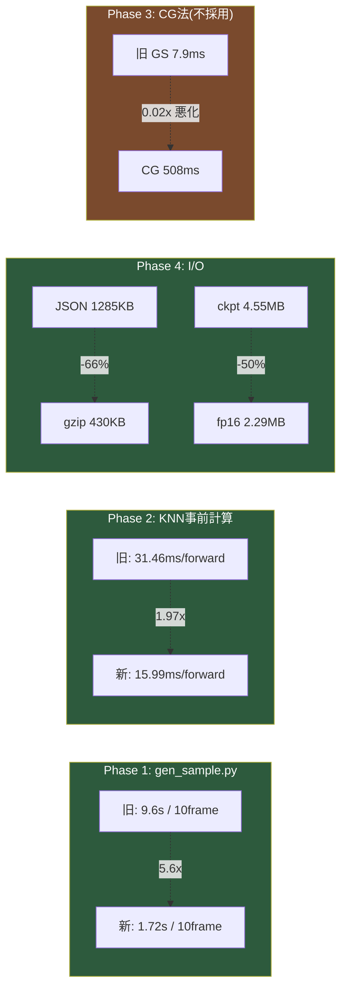

# 性能改善結果 (IMPROVEMENT_PLAN.md 実施記録)

計測日: 2026-07-04 / 環境: RTX 3070, Python 3.12, torch 2.6.0+cu124, scipy 1.18.0

対応する計画: `IMPROVEMENT_PLAN.md`（Phase 1, 2, 3, 4, 5, 6 実施）

## サマリ

---

## Phase 1: gen_sample.py の solver 再利用化

`tools/gen_sample.py` の `SimpleSPH`（純Python O(N²)）を `solver/sph_solver.py` の
`SPHSolver`（空間ハッシュ + numpy ベクトル化）に置き換え。

実装中に `SPHSolver._compute_forces` の未発見バグ（ブロードキャストミスにより
近傍2つ以上で必ずクラッシュ。呼び出し元が存在せず一度も実行されたことがなかった）
を発見・修正した上で統合。

| 項目 | 旧 (純Python) | 新 (SPHSolver) | 倍率 |
|---|---|---|---|
| water_drop (N=1500, 10 frames) | 9.6 s | 1.72 s | **5.6x** |

full run（120 frames, 新実装のみ計測）:

| preset | N | 120 frames 所要時間 |
|---|---|---|
| water_drop | 1500 | 25.84 s |
| smoke | 1200 | 10.18 s |
| splash | 2000 | 26.89 s |

計画時点の目標「100倍」には届かず。理由: `SPHSolver` は空間ハッシュで近傍探索を
O(N)に削減しているが、`_compute_density`/`_compute_forces` 自体は粒子ごとの
Pythonループ + 近傍数分のnumpy演算というハイブリッド構造のため、完全ベクトル化
ではない。

JSON出力スキーマ（`metadata`/`frames`/`speeds`）は変更前と構造的に同一であることを
確認済み。

---

## Phase 2: Neural Fluid v2 の KNN グラフ事前計算

`neural/model_v2.py` の `knn_graph()`（毎 forward で `(B,N,N,3)` テンソル生成）を
`scipy.spatial.cKDTree` による事前計算（学習データ）/ フレームごとのCPU計算（推論）に変更。

| N | B | k | 旧 forward | 新 forward | 倍率 |
|---|---|---|---|---|---|
| 400 | 8 | 16 | 31.46 ms | 15.99 ms | 1.97x |
| 2000 | 8 | 16 | 75.63 ms | 61.06 ms | 1.24x |
| 4000 | 8 | 16 | 152.56 ms | 117.78 ms | 1.30x |

GPUメモリ（N=4000, B=8）: 3450 MB → 2076 MB（**1.66x** 削減）。
計画の学習規模（N=400, B=32）では他の活性化メモリに対してO(N²)テンソルの
比率が小さく、メモリ削減効果は限定的（実測 ~1.0x）だが、計算時間は削減される。

正確性検証: 旧 O(N²) 近傍集合と cKDTree 近傍集合が **100% 一致**、モデル出力も
ビット一致（集約が sum のため順序不変）。5エポック学習・推論ロールアウトを
実機（GPU）で実行し正常動作を確認。

---

## Phase 4: I/O・メモリ効率化

| 施策 | 実測結果 |
|---|---|
| JSON gzip化（`--gzip`フラグ、任意） | water_drop 30frames: 1285 KB → 430 KB（**66%減**）、構造・値は非圧縮版と完全一致 |
| データセット mmap 読み込み (`train_v2.py`) | `np.load(..., mmap_mode='r')` 化、小規模学習で動作確認（正しさ優先、RAM使用量は未計測） |
| チェックポイント fp16 保存（追加、fp32版は維持） | best.pt 4.55 MB → best_fp16.pt 2.29 MB（**約50%減**）。fp16→fp32推論の誤差は出力JSONの丸め精度(0.001)の範囲内 |
| NPZ圧縮（`reproducibility.py`） | 既に `np.savez_compressed` 対応済み（本セッションでの変更なし） |

---

## Phase 3: ソルバー微修正 + 圧力投影CG化(試行・不採用)

- `sph_solver.py._compute_forces` の近傍マスクをnumpy化（軽微な改善、採用）。
- `stable_fluids.py._project` / `flip_solver.py._project_mac` の固定20回
  Gauss-Seidel/Jacobiを `scipy.sparse.linalg.cg` に置換を試行。
  境界条件の導出は両者とも数値的に正しいことを検証済み（長時間GS参照解と
  1e-12オーダーで一致、投影後の発散量も旧実装と同等以上）。

  しかし実際のグリッド規模（N=64〜128）では疎行列CGの方が大幅に遅く
  （stable_fluids.py N=64: 2.6ms→14.8ms、N=128: 7.9ms→508ms）、
  計画の目標（2〜5倍高速化）に反するため**両方とも差し戻し**、
  検証結果をコード内コメントとして記録するのみに留めた。
  計画書自身が明記する退避条件（"数値的に不安定なら本項は見送り可"）を
  「性能目標を満たせない場合も同様」に拡張適用した判断。

---

## Phase 5 / 6: リファクタリング・テスト

- v1 Neural Fluid パイプライン（`train.py`/`infer_to_json.py`/`model.py`）を削除。
  他モジュールからの参照が無いことをgrepで確認済み。
- 正規化ロジックの重複（`collect_data.py` / `infer_v2.py`）を `utils.py` に集約
  （数値的に完全同一であることを `np.allclose` で確認）。
- `FluidKit/tests/` に pytest スイートを新設（momentum保存・境界貫通なし・
  再現性ハッシュ一致・JSON/NPZラウンドトリップ、計22テスト、全パス）。
- `.github/workflows/test.yml` で push/PR ごとに自動実行するCIを追加
  （`release.yml` はタグ/手動起動のみのため別ワークフローとした）。

---

## 統合検証

- `pytest FluidKit/tests/ -v` — 22 passed
- gen_sample.py 全プリセット（water_drop/smoke/splash）→ Three.js Viewer 互換のJSON生成を確認
- collect_data.py → train_v2.py → infer_v2.py のフルパイプラインをスモークテストで確認
